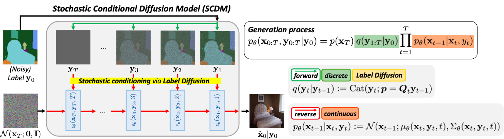

# Stochastic Conditional Diffusion Models for Robust Semantic Image Synthesis

Official PyTorch implementation of "[Stochastic Conditional Diffusion Models for Robust Semantic Image Synthesis](https://arxiv.org/abs/2402.16506)" (ICML 2024).
> Juyeon Ko*, Inho Kong*, Dogyun Park, Hyunwoo J. Kim†. 
> 
> Department of Computer Science and Engineering, Korea University




[](https://paperswithcode.com/sota/conditional-image-generation-on-celebamask-hq?p=stochastic-conditional-diffusion-models-for)
[](https://paperswithcode.com/sota/image-to-image-translation-on-ade20k-labels?p=stochastic-conditional-diffusion-models-for)
[](https://paperswithcode.com/sota/image-to-image-translation-on-coco-stuff?p=stochastic-conditional-diffusion-models-for)
[](https://paperswithcode.com/sota/noisy-semantic-image-synthesis-on-noisy?p=stochastic-conditional-diffusion-models-for)
[](https://paperswithcode.com/sota/noisy-semantic-image-synthesis-on-noisy-1?p=stochastic-conditional-diffusion-models-for)
[](https://paperswithcode.com/sota/noisy-semantic-image-synthesis-on-noisy-2?p=stochastic-conditional-diffusion-models-for)

## Setup
- Clone repository
  
  ```bash
  git clone https://github.com/mlvlab/SCDM.git
  cd SCDM
  ```
- Setup conda environment
  
  ```bash
  conda env create -f environment.yaml
  conda activate scdm
  ```

## Dataset Preparation

### Standard (clean) SIS
- **CelebAMask-HQ** can be downloaded from [CelebAMask-HQ](https://github.com/switchablenorms/CelebAMask-HQ). The dataset should be structured as below:
  ```
  CelebAMask/
  ├─ train/
  │  ├─ images/
  │  │  ├─ 0.jpg
  │  │  ├─ ...
  │  │  ├─ 27999.jpg
  │  ├─ labels/
  │  │  ├─ 0.png
  │  │  ├─ ...
  │  │  ├─ 27999.png
  ├─ test/
  │  ├─ images/
  │  │  ├─ 28000.jpg
  │  │  ├─ ...
  │  │  ├─ 29999.jpg
  │  ├─ labels/
  │  │  ├─ 28000.png
  │  │  ├─ ...
  │  │  ├─ 29999.png
  ```
  
- **ADE20K** can be downloaded from [MIT Scene Parsing Benchmark](http://data.csail.mit.edu/places/ADEchallenge/ADEChallengeData2016.zip), and we followed [SPADE](https://github.com/NVlabs/SPADE?tab=readme-ov-file#dataset-preparation) for preparation. The dataset should be structured as below:
  ```
  ADE20K/
  ├─ ADEChallengeData2016/
  │  │  ├─ images/
  │  │  │  ├─ training/
  │  │  │  │  ├─ ADE_train_00000001.jpg
  │  │  │  │  ├─ ...
  │  │  │  ├─ validation/
  │  │  │  │  ├─ ADE_val_00000001.jpg
  │  │  │  │  ├─ ...
  │  │  ├─ annotations/
  │  │  │  ├─ training/
  │  │  │  │  ├─ ADE_train_00000001.png
  │  │  │  │  ├─ ...
  │  │  │  ├─ validation/
  │  │  │  │  ├─ ADE_val_00000001.png
  │  │  │  │  ├─ ...
  ```

- **COCO-STUFF** can be downloaded from [cocostuff](https://github.com/nightrome/cocostuff), and we followed [SPADE](https://github.com/NVlabs/SPADE?tab=readme-ov-file#dataset-preparation) for preparation. The dataset should be structured as below:
  ```
  coco/
  ├─ train_img/
  │  ├─ 000000000009.jpg
  │  ├─ ...
  ├─ train_label/
  │  ├─ 000000000009.png
  │  ├─ ...
  ├─ train_inst/
  │  ├─ 000000000009.png
  │  ├─ ...
  ├─ val_img/
  │  ├─ 000000000139.jpg
  │  ├─ ...
  ├─ val_label/
  │  ├─ 000000000139.png
  │  ├─ ...
  ├─ val_inst/
  │  ├─ 000000000139.png
  │  ├─ ...
  ```

### Noisy SIS dataset for evaluation
Our noisy SIS dataset for three benchmark settings (DS, Edge, and Random) based on ADE20K is available at [Google Drive](https://drive.google.com/drive/folders/1KvGETbHUaqnLcslkwDxcWzoU7ixtvy9L?usp=sharing).
You can also generate the same dataset by running Python codes at `image_process/`.

## Experiments
You can set CUDA visible devices by `VISIBLE_DEVICES=${GPU_ID}`. (e.g., `VISIBLE_DEVICES=0,1,2,3`)

### Training
- Run
  
  ```
  sh scripts/train.sh
  ```
- For more details, please refer to `scripts/train.sh`.
- Pretrained models are available at [Google Drive](https://drive.google.com/drive/folders/1OGrIyYuk7EtFwBuHsD1DkN9cSHCOqq-w?usp=sharing).

### Sampling
- Run
  
  ```
  sh scripts/sample.sh
  ```
- For more details, please refer to `scripts/sample.sh`.
- Our samples are available at [Google Drive](https://drive.google.com/drive/folders/1bNRX1PC2Q_rH0Nudk9QSmVQ2O-E4D8D0?usp=sharing).

### Evaluation
- FID (fidelity)

  The code is based on [OASIS](https://github.com/boschresearch/OASIS).

  ```
  python evaluations/fid/tests_with_FID.py --path {SAMPLE_PATH} {GT_IMAGE_PATH} -b {BATCH_SIZE} --gpu {GPU_ID}
  ```
  
- LPIPS (diversity)

  You should generate 10 sets of samples, and make `lpips_list.txt` with `evaluations/lpips/make_lpips_list.py`. The code is based on [stargan-v2](https://github.com/clovaai/stargan-v2).
    
  ```
  python evaluations/lpips/lpips.py --root_path results/ade20k --test_list lpips_list.txt --batch_size 10
  ```
  
- mIoU (correspondence)
  - **CelebAMask-HQ**: [U-Net](https://github.com/NVlabs/imaginaire/blob/master/imaginaire/evaluation/segmentation/celebamask_hq.py). Clone the repo and set up environments from [imaginaire](https://github.com/NVlabs/imaginaire), and add `evaluation/miou/test_celeba.py` to `imaginaire/`. Check out `evaluation/miou/celeba_config.yaml` for the config file and fix the path accordingly.
    
    ```bash
    cd imaginaire
    python test_celeba.py
    ```
    
  - **ADE20K**: Vit-Adapter-S with UperNet. Clone the repo and set up environments from [Vit-Adapter](https://github.com/czczup/ViT-Adapter/tree/main/segmentation).
    
    ```bash
    cd ViT-Adapter/segmentation
    bash dist_test.sh \
         configs/ade20k/upernet_deit_adapter_small_512_160k_ade20k.py \
         pretrained/upernet_deit_adapter_small_512_160k_ade20k.pth \
         1 \ # NUM_GPUS
         --eval mIoU \
         --img_dir {SAMPLE_DIR} \
         --ann_dir {LABEL_DIR} \
         --root_dir {SAMPLE_ROOT_DIR}
    ```
  - **COCO-STUFF**: [DeepLabV2](https://github.com/NVlabs/imaginaire/blob/master/imaginaire/evaluation/segmentation/cocostuff.py). Clone the repo and set up environments from [imaginaire](https://github.com/NVlabs/imaginaire), and add `evaluation/miou/test_coco.py` to `imaginaire/`. Check out `evaluation/miou/coco_config.yaml` for the config file and fix the path accordingly.
    

    ```bash
    cd imaginaire
    python test_coco.py
    ```

## Acknowledgement

This repository is built upon [guided-diffusion](https://github.com/openai/guided-diffusion) and [SDM](https://github.com/WeilunWang/semantic-diffusion-model).

## Citation
If you use this work, please cite as:
```bibtex
@article{ko2024stochastic,
  title={Stochastic Conditional Diffusion Models for Robust Semantic Image Synthesis},
  author={Ko, Juyeon and Kong, Inho and Park, Dogyun and Kim, Hyunwoo J},
  journal={arXiv preprint arXiv:2402.16506},
  year={2024}
}
```

## Contact

Feel free to contact us if you need help or explanations!

- Juyeon Ko (juyon98@korea.ac.kr)
- Inho Kong (inh212@korea.ac.kr)
